<picture>
  <source media="(prefers-color-scheme: dark)" srcset="dark.svg">
  <source media="(prefers-color-scheme: light)" srcset="light.svg">
  
</picture>

 

<table align="center">
<tr>
<td width="49%">

</td>
<td width="49%">

</td>
</tr>
</table>

<picture>
  <source media="(prefers-color-scheme: dark)" srcset="https://raw.githubusercontent.com/space-rock-0/space-rock-0/output/snake-dark.svg?v=2">
  <source media="(prefers-color-scheme: light)" srcset="https://raw.githubusercontent.com/space-rock-0/space-rock-0/output/snake-light.svg?v=2">
  
</picture>

&nbsp;&nbsp;&nbsp;&nbsp;&nbsp;&nbsp;

